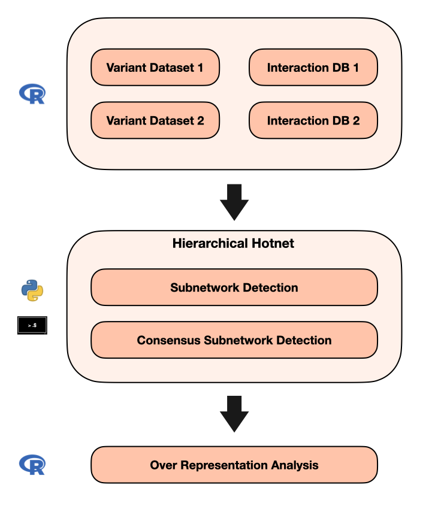

<!-- README.md is generated from README.Rmd. Please edit that file -->

# VarSubnetDetection

This supports the detection and analysis of altered subnetworks for
epilepsy mutations using the hierarchical hotnet algorithm \[Reyna,
Leiserson, and Raphael (2018)\]\[<https://github.com/raphael->
group/hierarchical-hotnet.git\]. The two WES epilepsy datasets CoGIE and
EpiPGX were analyzed in the study (May et al. 2018) and the
loss-of-function and Non-synonmyous mutations were considered in this
study.

# Study design

# Implementation details

The datasets were received in-house. The analysis was carried out in two
parts.

-   In the first part, subnetworks and genes were detected for the
    above-mentioned datasets using the HPC cluster Iris at the
    University of Luxembourg.

-   In the second part, over-representation of detected genes and
    networks were further analyzed via the clusterProfiler (Yu et
    al. 2012) functions in R.

# Contact

For questions and comments, please contact <sreyoc2999@gmail.com>

# References

May, Patrick, Simon Girard, Merle Harrer, Dheeraj R Bobbili, Julian
Schubert, Stefan Wolking, Felicitas Becker, et al. 2018. “Rare Coding
Variants in Genes Encoding GABAA Receptors in Genetic Generalised
Epilepsies: An Exome-Based Case-Control Study.” *The Lancet Neurology*
17 (8): 699–708.

Reyna, Matthew A, Mark DM Leiserson, and Benjamin J Raphael. 2018.
“Hierarchical HotNet: Identifying Hierarchies of Altered Subnetworks.”
*Bioinformatics* 34 (17): i972–80.

Yu, Guangchuang, Li-Gen Wang, Yanyan Han, and Qing-Yu He. 2012.
“clusterProfiler: An r Package for Comparing Biological Themes Among
Gene Clusters.” *OMICS: A Journal of Integrative Biology* 16 (5):
284–87. <https://doi.org/10.1089/omi.2011.0118>.

